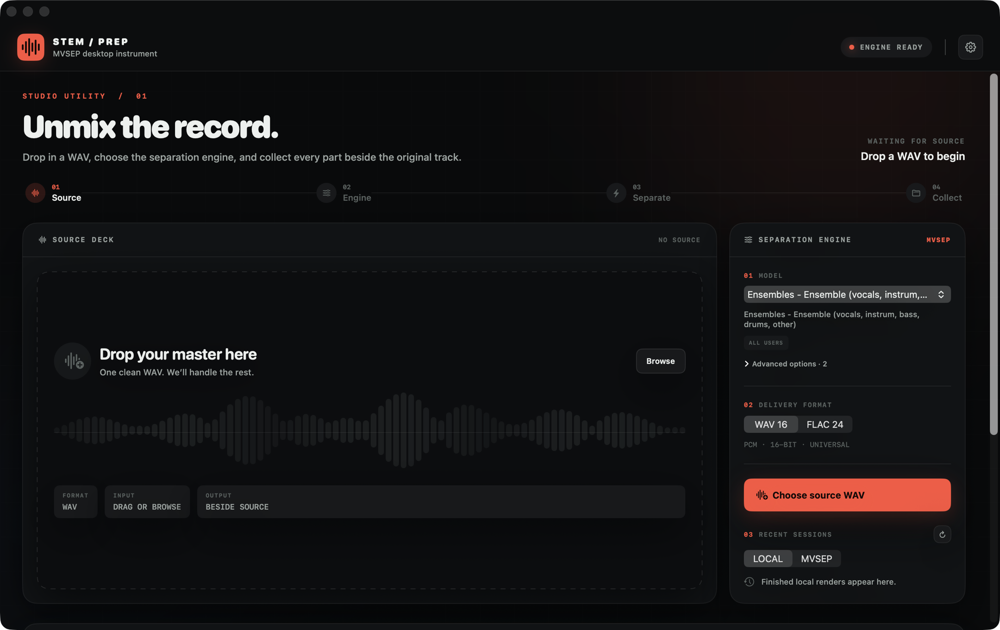

# StemPrep

StemPrep is a native macOS app that sends a WAV to [MVSEP](https://mvsep.com/en), tracks the separation job, and saves every returned stem beside the original track.



## Highlights

- Live MVSEP model catalogue with the exact selected `render_id`
- Live queue position and real chunk progress inside the source waveform
- Model availability, credit estimates and supported advanced options
- WAV, FLAC and MP3 delivery options
- File-backed uploads avoid holding the full WAV in memory and remove their temporary staging file after submission
- Resumable job tracking, MVSEP history and finished-job re-downloads
- Queued-job cancellation through MVSEP when a refund is available
- Private account status for balance, premium use and active jobs
- Duplicate-render detection to avoid repeating paid jobs
- Output folders created beside the source track
- API token stored in macOS Keychain
- No analytics, advertising or developer-operated server

## Requirements

- macOS 14 Sonoma or newer
- Intel or Apple silicon Mac
- An MVSEP account and API token
- A WAV source file

## Install

1. Download `StemPrep-v1.1.0.zip` from the [latest release](https://github.com/lordydord/StemPrep/releases/latest).
2. Unzip it and move `StemPrep.app` to Applications.
3. Open StemPrep. If macOS asks for confirmation, right-click the app and choose **Open**.
4. Follow the first-run guide to create or sign in to an MVSEP account and save your API token.

StemPrep v1.1 is ad-hoc signed and is not notarized with an Apple Developer ID. The source is available here for inspection and local builds.

## How it works

1. Drop a WAV into the app.
2. Choose the MVSEP separation model and output format.
3. Start the separation.
4. StemPrep writes a sibling folder named `<Track Name> Stems` containing the original, all returned stems and a JSON manifest.

Your audio is uploaded directly to MVSEP. StemPrep does not proxy it through another service. Read [Privacy](PRIVACY.md) before using the app with sensitive material.

## API token

Open the [MVSEP User API page](https://mvsep.com/user-api), create an account or sign in, then copy the API token shown on that page. StemPrep stores the token in macOS Keychain and uses it only for requests to MVSEP.

## Build from source

Install Xcode 16 or newer, then run:

```bash
git clone https://github.com/lordydord/StemPrep.git
cd StemPrep
swift test
./script/build_and_run.sh --bundle
```

The universal app bundle is written to `dist/StemPrep.app`.

To install the local build in Applications:

```bash
./script/install_app.sh
```

## Command-line analyser

The repository also contains the earlier Python audio-prep workflow. It estimates BPM and a first musical downbeat, creates a prepared WAV, and can submit it to MVSEP.

```bash
python3.11 -m venv .venv
.venv/bin/python -m pip install -r requirements.txt
cp .env.example .env
.venv/bin/python stem_prep.py process "/path/to/track.mp3"
```

The private `.env` file is ignored by Git. Never commit a real API token.

## Project status

Version 1.1 adds truthful remote progress, account and credit context, advanced model options, MVSEP history, re-downloads and queued-job cancellation. Bug reports and focused pull requests are welcome through [GitHub Issues](https://github.com/lordydord/StemPrep/issues).

StemPrep is an independent open-source project and is not affiliated with MVSEP or Ableton.

## License

[MIT](LICENSE)
